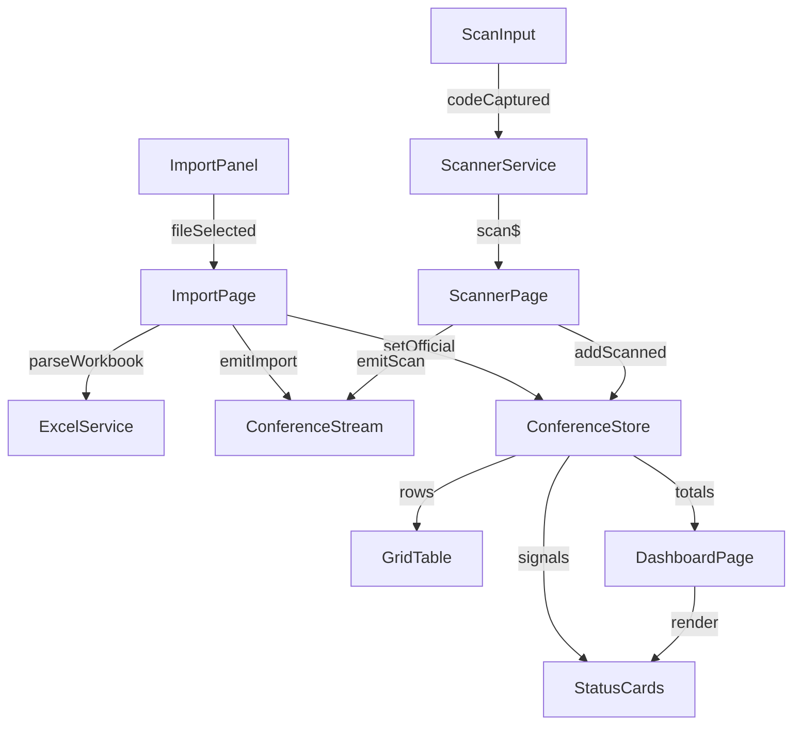

# Arquitetura e Fluxos

## Visão Geral
- **Framework:** Angular 17 com componentes standalone, Signals e RxJS.
- **Shell:** `AppComponent` mantém apenas a navegação e um `<router-outlet>`, deixando as páginas carregarem sob demanda.
- **Domínios:** `dashboard` entrega indicadores globais e `conference` concentra a operação (importação + scanner).
- **Serviços centrais:**
  - `ExcelService` converte arquivos CSV/XLSX em listas de IDs.
  - `ScannerService` propaga eventos de bipagem, inclusive entradas manuais.
  - `ConferenceStream` distribui eventos reativos (importações e scans) para efeitos e integrações futuras.
  - `ConferenceStore` armazena estado derivado com Signals e oferece seletores (`totals`, `officialRows`, `scannedRows`).
  - `GridTableComponent` vive em `shared/` para reaproveitamento geral; `StatusCardsComponent` permanece no domínio Conference, mas é importado também pelo Dashboard.

## Roteamento e Carregamento sob Demanda
`app.routes.ts` utiliza `loadComponent` para isolar o carregamento das páginas. Cada container vive em sua própria pasta dentro de `domains/<domínio>/pages`.

| Rota        | Componente / Diretório                               | Responsabilidade principal                          |
|-------------|------------------------------------------------------|-----------------------------------------------------|
| `/`         | `DashboardPageComponent` (`domains/dashboard/pages`)  | KPIs globais e atalho para fluxos operacionais.     |
| `/importacao` | `ImportPageComponent` (`domains/conference/pages/import-page`) | Upload de planilhas, preview da lista oficial.      |
| `/scanner`  | `ScannerPageComponent` (`domains/conference/pages/scanner-page`) | Entrada manual/automática de bipagens em tempo real.|

`ConferencePageComponent` permanece disponível como container para cenários multi-widget dentro do domínio (apontado manualmente quando necessário), porém o roteamento principal aponta para os três fluxos acima.

## Componentes Principais
- **ImportPageComponent**: orquestra o upload, administra `isLoading`/`errorMessage`, traduz as colunas (A → ID numérico, C → motivo) e aplica `ConferenceStore.setOfficial` + `ConferenceStream.emitImport` ao finalizar a leitura.
- **ScannerPageComponent**: injeta `ScannerService`, inscreve-se em `scan$` com `takeUntilDestroyed`, bloqueia duplicidades com `ConferenceStore.addScanned` e, quando necessário, alerta o operador via `MatSnackBar` antes de emitir `ConferenceStream.emitScan`.
- **DashboardPageComponent**: consome apenas Signals computadas do `ConferenceStore` e reutiliza `StatusCardsComponent` para exibir KPIs.
- **ImportPanelComponent**: encapsula o `<input type="file">`, valida o `FileList` e emite um `File` seguro para a página.
- **ScanInputComponent**: captura entradas manuais e as envia para `ScannerService.emitScan`, garantindo que o fluxo manual/hardware compartilhe a mesma fonte de verdade.
- **StatusCardsComponent**: apresenta totais derivados (`ok`, `faltantes`, `excedentes`) em cartões responsivos, consumindo apenas Signals.
- **GridTableComponent**: tabela genérica em `shared/` que recebe colunas e linhas, utilizada nas páginas de importação e scanner para mostrar listas oficiais/bipadas.

### Componentes Planejados/Futuros
- **ResultPanelComponent**: reservado para gráficos/listagens específicas da conferência. Ainda não é importado por nenhuma rota; permanecerá no repositório até que as telas analíticas sejam priorizadas.
- **StorageService**: previsto para persistir o estado local da conferência (recuperando dados após refresh). O serviço está implementado, porém não é injetado em produção; será conectado quando o requisito “Persistência local” for iniciado.

## Fluxo de Importação
1. `ImportPanelComponent` valida o `FileList` e emite apenas um `File` válido.
2. `ImportPageComponent` reseta erros, sinaliza `isLoading` e executa `ExcelService.parseWorkbook(file)`.
3. `ExcelService` interpreta a coluna **A** (a partir de `A2`) como ID numérico e a coluna **C** (a partir de `C2`) como motivo (`Produto danificado`, `Destinatário ausente`, `Endereço incorreto`).
4. Com a planilha lida:
  - `ConferenceStore.setOfficial(entries)` persiste a lista oficial com motivo normalizado.
  - `ConferenceStream.emitImport(entries)` notifica fluxos reativos (ex.: auditorias futuras).
5. Em caso de erro, `errorMessage` é preenchido e o estado de carregamento é revertido.
6. `StatusCardsComponent` e `GridTableComponent` consomem `totals`/`officialRows`, refletindo o resultado imediatamente.
7. O Dashboard usa `issueTotals` para exibir a distribuição de motivos importados.

## Fluxo de Scanner
1. `ScannerService` recebe eventos por duas fontes: hardware (listener registrado no serviço) e `ScanInputComponent` (manual) via `emitScan`.
2. `ScannerPageComponent` injeta o serviço e se inscreve em `scan$` usando `takeUntilDestroyed`.
3. A cada código:
  - `ConferenceStore.addScanned(code)` verifica duplicidade; se o ID já existir nada é salvo e um aviso visual é disparado.
  - Quando a inclusão é aceita, `ConferenceStream.emitScan(code)` propaga o evento para integrações e dashboards.
4. O componente também expõe `handleManualEntry` que delega para `ScannerService.emitScan`, mantendo uma única fonte de verdade.
5. `StatusCardsComponent` e `GridTableComponent` usam `scannedRows` para mostrar o progresso em tempo real.

## Interação entre Componentes

## Próximas Evoluções
- Persistir estado com `StorageService` para manter a conferência mesmo após refresh.
- Expandir notificações para outros conflitos (erros de hardware, motivos inválidos) aproveitando o padrão aplicado às duplicidades.
- Criar módulos adicionais (devoluções, inventário) reutilizando o mesmo padrão de rotas lazy + Signals.
